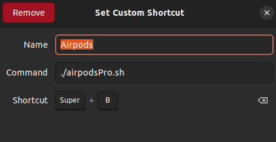

# Connecting Bluetooth devices to your linux desctop
If you want to automate connecting and disconnecting your Airpods to your laptop clicking a couple of buttons then you are in the right place.

Here you'll find the easy way to do it.

Just follow the steps.

## Step 1. Create a clone 
## Step 2. Change the content of the variable `airpods_address`
1. Change the content of the variable `airpods_address` in file `config.py` to your device's address.

How to check the address of your device?
Just connect your device routine way and run this command `bluetoothctl info` in the console. The first string will be the address of your device.

Write out this code in the `config.py`
```python
airpods_address = 'ID of your device'
```
## Step 3. Change the path to your `main.py` file 
0. Open the directory where is the repo 
1. Use the command to know the path to the file `readlink -f scr/main.py`
2. Open file `airpodsPro.sh` and change the path to yours
Here
```bash
python3 /home/connect_airpods_python/scr/main.py
```


## Step 4. Make a copy if `.sh` file in your home directory
## Step 5. Change the rules
Execute this command to make the script runnable for you : `chmod u+x airpodsPro.sh`

## 6. Add Shortcut
You can do use UI:

`Settings -> Keyboard -> Keyboard Shortcuts -> scroll down -> Custom Shortcuts`




### The end :)